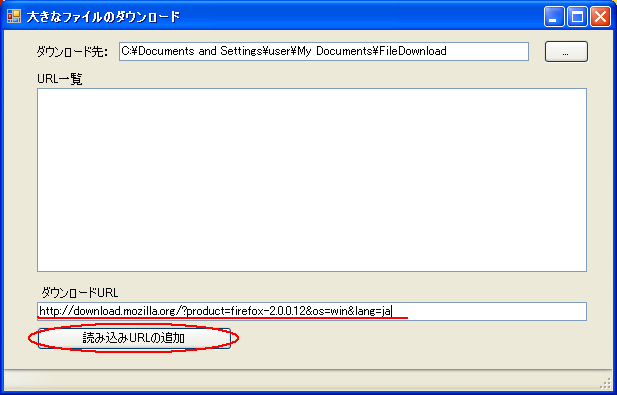

# 大きなファイルを効率良くダウンロード

## 概要

マイクロソフトのダウンロードサイトから数百から数ギガの大きなファイルをダウンロードする場合、ダウンロード途中で接続が切断されると、せっかく今までダウンロードしたファイルが無駄になり、また最初からダウンロードを始める必要があります。 

今までダウンロードしたファイルを無駄にせず続きからダウンロードできないか？ 

ネットワークが一時的に切断された場合でもネットワークに接続できたら前回の続きからダウンロードできたら便利だと思い、このプログラムを作成しました。 

## URLを指定してファイルをダウンロード

ダウンロードしたいファイルのURLをダウンロードURLの欄に入力して 「読み込みURLの追加」ボタンをクリックします。

するとファイルのダウンロードを開始します。

ダウンロード中に別の新しいダウンロードURLを登録することもできます。

もし、ダウンロードの途中でネットワーク接続が切断された場合にはネットワークに接続できるようになったタイミングで ダウンロードを継続します。

ダウンロードの途中でアプリケーションを終了した場合には次回にアプリケーションを起動した場合、 前回のダウンロード未完了のファイルがあれば自動的にダウンロードを開始します。

ダウンロードしたファイルは 

現在のユーザの ドキュメントフォルダの `FileDownload` という名前のフォルダ の中に 格納されます。

## 一括ダウンロード手順

ドキュメントフォルダの中の `FileDownload` フォルダの中に

filelist.txt 

というファイルに ダウンロードしたいURL を登録すると
次回 アプリ起動時に そのファイルから連続してファイルをダウンロードします。

